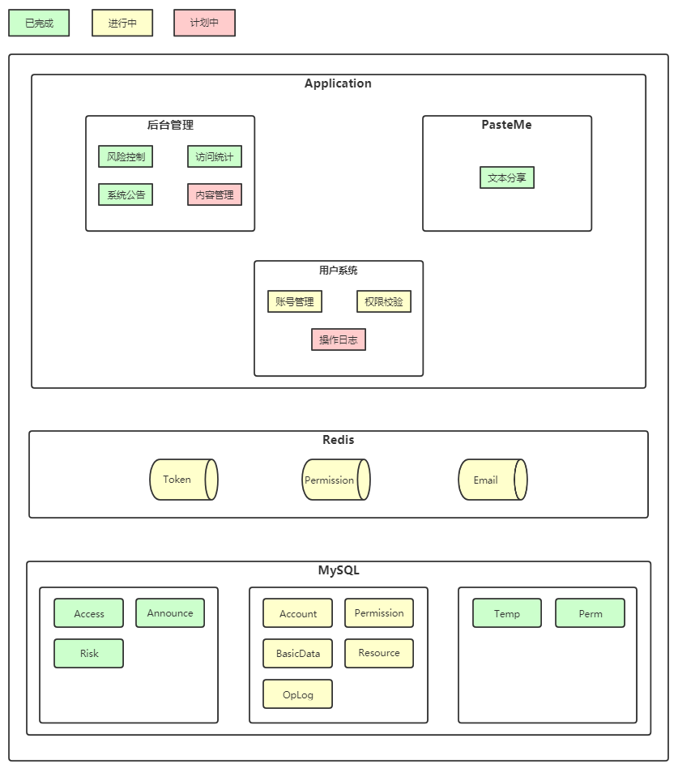
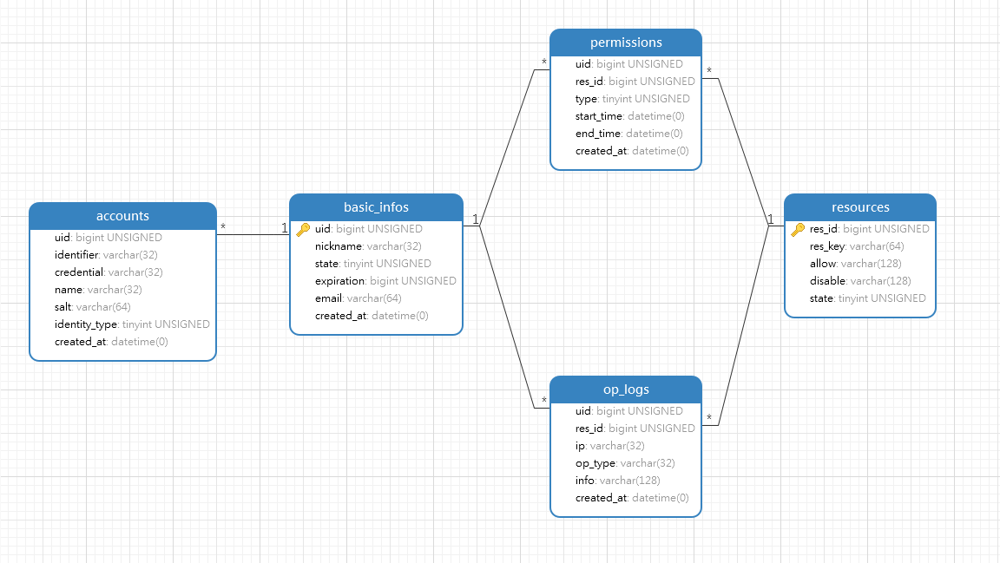

# 用户系统详细设计

### PasteMe 结构现状梳理

> 用户系统提供通用的用户管理服务，以账号信息和权限校验两个核心功能为主，对外提供`Http`服务，通过`Oauth2`进行服务间调用鉴权。
>
> `Redis`主要用于查多改少、热点等类型的数据，提高系统性能。Token、Permission、Email三部分缓存分别用于用户有效token信息，用户资源使用次数信息，邮箱验证码信息。

### 数据库设计

#### 账户表-account

> 用户表用于记录账号信息，与用户基础信息表通过`uid`多对一关联，支持用户名、手机号、邮箱和第三方多种登录方式。

| field         | comment                                        |
| ------------- | ---------------------------------------------- |
| uid           | 用户全局标识                                   |
| identifier    | 用户登录标识，例如用户名、手机号、邮箱、第三方 |
| credential    | 密码凭证，例如密码、第三方token                |
| name          | 真实姓名                                       |
| salt          | 密码盐                                         |
| identity_type | 登录类型，例如用户名、手机号、邮箱、第三方     |

#### 用户基础信息表-basic_info

> 用户基础信息表用于记录用户昵称、状态等相关信息，用于记录用户属性，每一个用户对应一条记录。

| field      | comment                 |
| ---------- | ----------------------- |
| uid        | 用户全局标识            |
| nickname   | 用户昵称，默认为用户名  |
| state      | 未注册/生效/禁用        |
| expiration | 用户自定义token过期时间 |
| email      | 用户创建时验证用的邮箱  |

#### 资源表-resource

> 资源表通过请求方式和请求地址唯一标识，用于资源权限校验。

| field   | comment          |
| ------- | ---------------- |
| res_id  | 资源唯一标识     |
| res_key | 请求方式+URL     |
| allow   | 白名单           |
| disable | 黑名单           |
| state   | 0为生效，1为禁用 |

#### 权限规则表-permission

> 用户和资源的关联关系表，直接用于校验用户权限，**可考虑用缓存的`Permission`表代替。**

| field      | comment                          |
| ---------- | -------------------------------- |
| uid        | 用户全局标识                     |
| res_id     | 资源唯一标识                     |
| type       | 0为生效，1为禁用，1的优先级高于0 |
| start_time | 规则开始时间                     |
| end_time   | 规则结束时间                     |

#### 操作日志表-op_log

> 用于记录用户的关键操作日志，用于操作/故障追溯，以及异常恢复等。

| field   | comment      |
| ------- | ------------ |
| uid     | 用户全局标识 |
| res_id  | 资源唯一标识 |
| ip      |              |
| op_type | 操作类型     |
| info    | 操作详情     |

### 接口文档

| 功能点         | API                          | 请求格式                                                     | 响应格式                                             | 备注                              |
| -------------- | ---------------------------- | ------------------------------------------------------------ | ---------------------------------------------------- | --------------------------------- |
| 注册账号       | [POST]/account/accounts      | email string username string password string verification string | -                                                    |                                   |
| 冻结账号       | [PUT]/account/accounts/{uid} | -                                                            | -                                                    |                                   |
| 修改密码       | [PUT]/account/passwords      | email string password string newPassword string verification string | -                                                    |                                   |
| 修改基础信息   | [PUT]/account/basics/{uid}   | nickname string expiration string                       | -                                                    | 包含昵称修改和 token 过期时间修改 |
| 申请 API Token | [GET]/account/tokens/{uid}   | -                                                            | token string                                         |                                   |
| 身份校验       | [GET]/permission/identities  | identifier string credential string identityType uint8 | isPassFlag bool uid uint64 nickname string |                                   |
| 权限校验       | [GET]/permission/permissions | uid uint64                                                   | isPassFlag bool                                      |                                   |
| 发送邮件       | [POST]/other/email           | email string message string                             | -                                                    |                                   |

### 后续改进

* 提取热点数据至缓存，提高 PasteMe 主服务的访问性能
* 缓存存储用户付费相关特权信息，提供商业化后的鉴权能力
